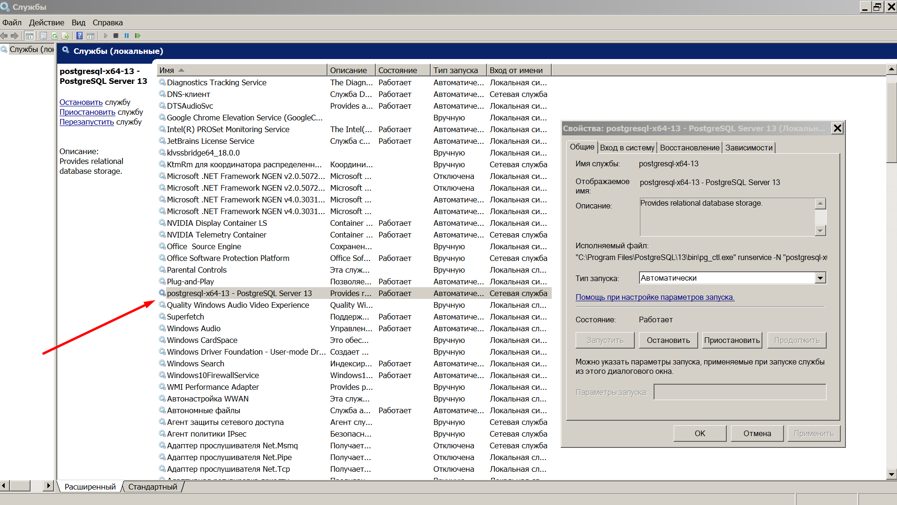
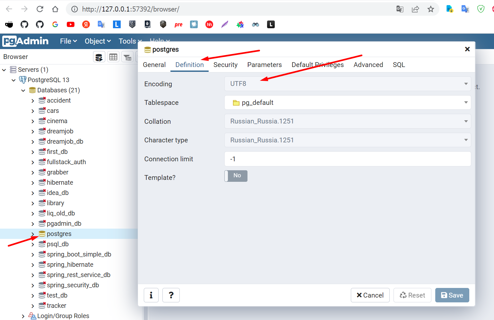

<h2>pgAdmin базовые возможности</h2>

Примечание: ПКМ, ЛКМ - правая и левая кнопка мыши 

Разделы:  
<a href="#01">01 Установка PostgreSQL и PgAdmin</a> 
<a href="#02">02 Создание базы данных в правильной кодировке</a> 

**01 Установка PostgreSQL и PgAdmin** - https://www.postgresql.org/download/  
Вместе с PostgreSQL уставливается и PgAdmin  
Во время установки задаем пароль суперпользователя (мастер-пароль) базы данных. 
Locale - English, United States 
Проверить установку PostgreSQL можно так: в Windows находим Службы и в них  
проверяем наличие службы PostgreSQL

Служба_PostgreSQL.png

 

После установки PgAdmin появляется в меню   
Пуск>Все программы>PostgreSQL(N)  
При запуске программы нужно указать мастер пароль, который вы укзывали
при установке.  
Также этот пароль понадобится при заходе в базу данных. 

Проверка кодировки  
Открываем Database > ПКМ на postgres > Properties > Definition 
Параметр Encoding = UTF8  
Важно обратить внимание на этот параметр и именно поэтому
мы выбирали локаль Locale - English, United States  
Если у вас кодировка UTF-8, то у вас будет меньше проблем
с экспортом и импортом данных

Проверка_кодировки.png

 

**02 Создание базы данных в правильной кодировке** 
Если кодировка вашей системы отличается от UTF-8
вы все равно сможете создать свою базу c UTF-8
ПКМ На Databases > Create > Database  
Во вкладке Definition можно вручную выбрать  
Encoding - UTF - 8  
Иногда система может потребовать использовать шаблон template0, 
тогда его вы тоже можете выбрать в этой вкладке

База_данных_в_ UTF-8.png

 

Также вам может потребоваться перенести все ваши таблицы
из старой базы в новую, это вы можете сделать через меню
Tools в верхней части программы - комады Backup и Restore
