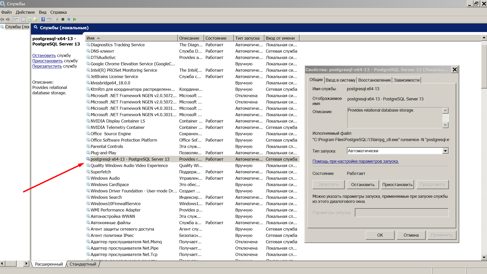
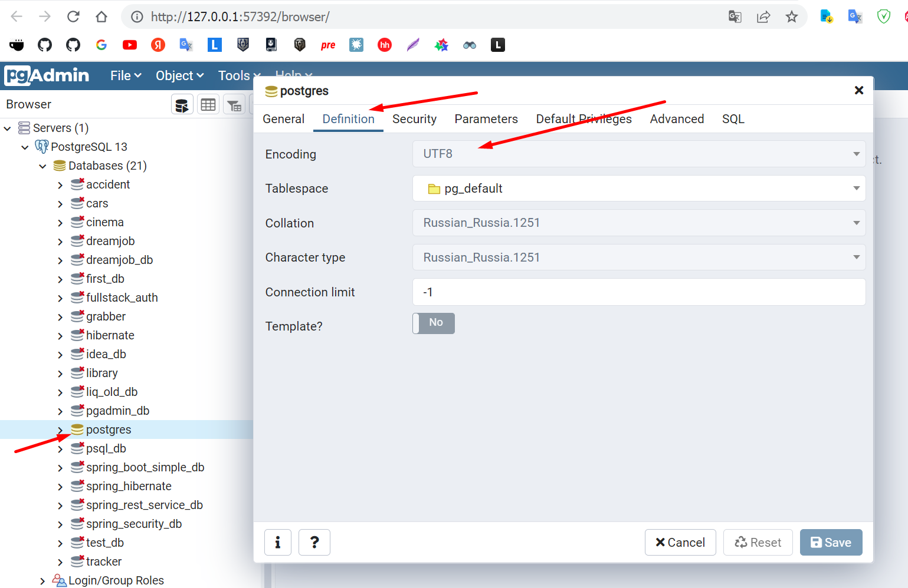

<h2>pgAdmin базовые возможности</h2>

Примечание: ПКМ, ЛКМ - правая и левая кнопка мыши

**01 Установка PostgreSQL и PgAdmin** - https://www.postgresql.org/download/  
Вместе с PostgreSQL уставливается и PgAdmin  
Во время установки задаем пароль суперпользователя (мастер-пароль) базы данных. 
Locale - English, United States 
Проверить установку PostgreSQL можно так: в Windows находим Службы и в них  
проверяем наличие службы PostgreSQL

01_Служба_PostgreSQL.png

 

После установки PgAdmin появляется в меню   
Пуск>Все программы>PostgreSQL(N)  
При запуске программы нужно указать мастер пароль, который вы укзывали
при установке.  
Также этот пароль понадобится при заходе в базу данных. 

Проверка кодировки  
Открываем Database > ПКМ на postgres > Properties > Definition
Параметр Encoding = UTF8
Важно обратить внимание на этот параметр и именно поэтому
мы выбирали локаль Locale - English, United States

01_Служба_PostgreSQL.png

 

