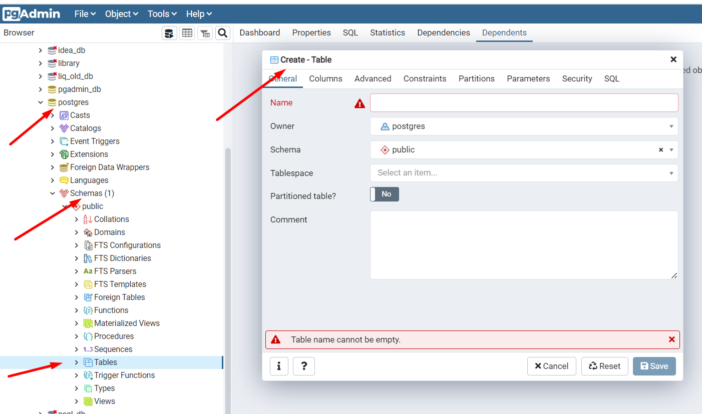
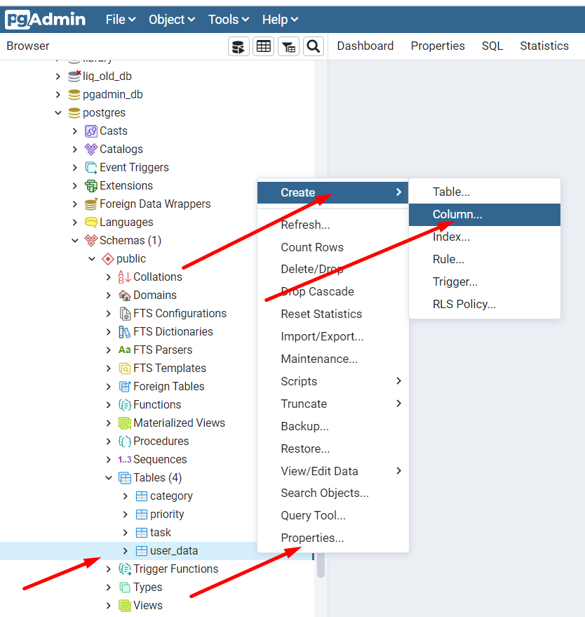
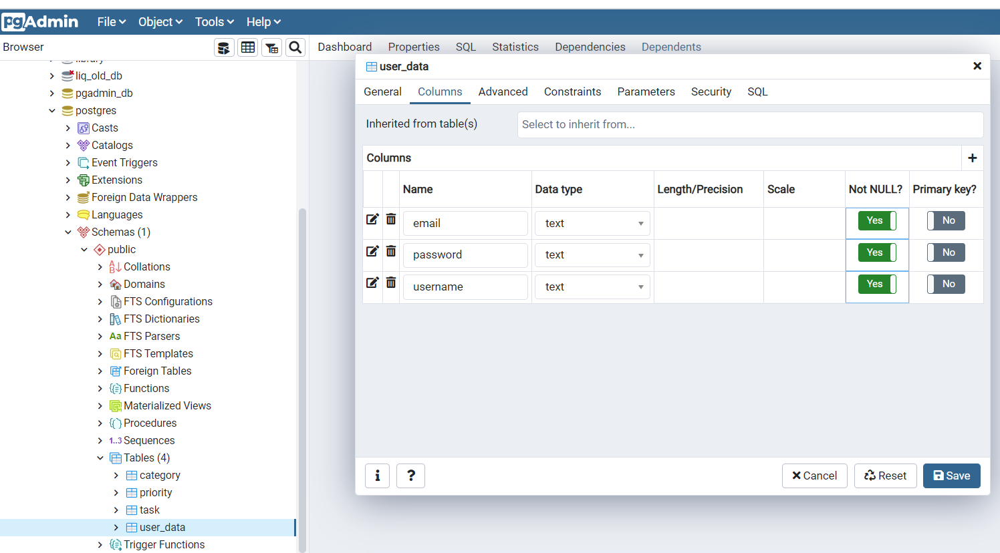

<h2>pgAdmin for beginner</h2>

Примечание: ПКМ, ЛКМ - правая и левая кнопка мыши 

Разделы:  
<a href="#01">01 Установка PostgreSQL и PgAdmin</a> 
<a href="#02">02 Создание базы данных в правильной кодировке</a> 
<a href="#03">03 Создание таблиц в pgAdmin</a> 
<a href="#04">04 Создание столбцов</a> 

**01 Установка PostgreSQL и PgAdmin** - https://www.postgresql.org/download/  
Вместе с PostgreSQL уставливается и PgAdmin  
Во время установки задаем пароль суперпользователя (мастер-пароль) базы данных. 
Locale - English, United States 
Проверить установку PostgreSQL можно так: в Windows находим Службы и в них  
проверяем наличие службы PostgreSQL

Служба_PostgreSQL.png

 

После установки PgAdmin появляется в меню   
Пуск>Все программы>PostgreSQL(N)  
При запуске программы нужно указать мастер-пароль, который 
вы указывали при установке.  
Также этот пароль понадобится при заходе в базу данных. 

Проверка кодировки  
Открываем Database > ПКМ на postgres > Properties > Definition 
Параметр Encoding = UTF8  
Важно обратить внимание на этот параметр и именно поэтому
мы выбирали локаль   
Locale - English, United States  
Если у вас кодировка UTF-8, то у вас будет меньше проблем
с экспортом и импортом данных

Проверка_кодировки.png

 

**02 Создание базы данных в правильной кодировке** 
Если кодировка вашей системы отличается от UTF-8
вы все равно сможете создать свою базу c UTF-8
ПКМ На Databases > Create > Database  
Во вкладке Definition можно вручную выбрать  
Encoding - UTF - 8  
Иногда система может потребовать использовать шаблон template0, 
тогда его вы тоже можете выбрать в этой вкладке

База_данных_в_ UTF-8.png

 

Также вам может потребоваться перенести все ваши таблицы
из старой базы в новую, это вы можете сделать через меню
Tools в верхней части программы - комады Backup и Restore

**03 Создание таблиц в pgAdmin** 
На примере базы данных postgres находим Tables,  
ПКМ > Create > Table  

Создать_таблицу.png

 

Задаем название таблицы, эти названия не должны 
пересекаться с ключевыми словами баз данных, иначе могут быть 
неожиданности, Owner - postgres, в комментариях указываем 
назначение таблицы и другую полезную информацию. 
Если после создания таблица не отобразилась в списке Tables, 
можно обновить данные   
ПКМ на Tables > Refresh  
Для примера создадим несколько таблиц: 
category, priority, task, user_data

**04 Создание столбцов** 
Создать столбцы можно двумя способами, 
Кликаем на таблицу ПКМ > Properties > Columns 
(можно создать сразу несколько колонок) или  
Кликаем на таблицу ПКМ > Create > Column 
(создаем по одной колонке)

Создать_колонки.png

 

Добавим следующие колонки в таблицу user_data: 
почта - обязательное значение 
пароль - обязательное значение 
имя - обязательное значение  

Колонки_для_userdata.png

 

После сохранения колонок можно сделать  
ПКМ на таблице > Refresh  
и увидеть наши колонки, развернув таблицу и подраздел 
Columns. Для редактирования колонок в дальнейшем 
мы точно также делаем: 
ПКМ на таблице > Properties > Columns 
и в окне, где показаны все столбцы кликаем на значок
редактирования слева от нужного столбца. 