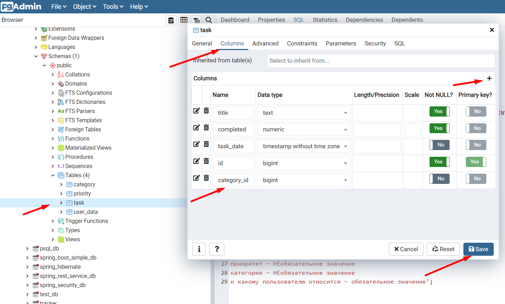

<h2>pgAdmin для начинающих</h2>

Примечание: ЛКМ, ПКМ - левая, правая кнопка мыши 

Вопросы:  
<a href="#01">01 Установка PostgreSQL и PgAdmin</a> 
<a href="#02">02 Создание базы данных в правильной кодировке</a> 
<a href="#03">03 Создание таблиц в pgAdmin</a> 
<a href="#04">04 Создание столбцов</a> 
<a href="#05">05 PgAdmin - первичный ключ в PostgreSQL</a> 
<a href="#06">06 Создание базовых колонок</a> 
<a href="#07">07 Код таблицы DDL в PostgreSQL</a> 
<a href="#08">08 Поле ID Autoincrement</a> 
<a href="#09">09 Создание Foreign key – внешний ключ</a> 

**01 Установка PostgreSQL и PgAdmin** - https://www.postgresql.org/download/  
Вместе с PostgreSQL уставливается и PgAdmin  
Во время установки задаем пароль суперпользователя (мастер-пароль) базы данных. 
Locale - English, United States 
Проверить установку PostgreSQL можно так: в Windows находим Службы и в них  
проверяем наличие службы PostgreSQL

Служба_PostgreSQL.png

 

После установки PgAdmin появляется в меню   
Пуск>Все программы>PostgreSQL(N)  
При запуске программы нужно указать мастер-пароль, который 
вы указывали при установке.  
Также этот пароль понадобится при заходе в базу данных. 

Проверка кодировки  
Открываем Database > ПКМ на postgres > Properties > Definition 
Параметр Encoding = UTF8  
Важно обратить внимание на этот параметр и именно поэтому
мы выбирали локаль   
Locale - English, United States  
Если у вас кодировка UTF-8, то у вас будет меньше проблем
с экспортом и импортом данных

Проверка_кодировки.png

 

**02 Создание базы данных в правильной кодировке** 
Если кодировка вашей системы отличается от UTF-8
вы все равно сможете создать свою базу c UTF-8 
ПКМ На Databases > Create > Database  
Во вкладке Definition можно вручную выбрать  
Encoding - UTF - 8  
Иногда система может потребовать использовать шаблон template0, 
тогда его вы тоже можете выбрать в этой вкладке

База_данных_в_ UTF-8.png

 

Также вам может потребоваться перенести все ваши таблицы
из старой базы в новую, это вы можете сделать через меню
Tools в верхней части программы - комады Backup и Restore

**03 Создание таблиц в pgAdmin** 
На примере базы данных postgres находим Tables,  
ПКМ > Create > Table  

Создать_таблицу.png

 

Задаем название таблицы, эти названия не должны 
пересекаться с ключевыми словами баз данных, иначе могут быть 
неожиданности, Owner - postgres, в комментариях указываем 
назначение таблицы и другую полезную информацию. 
Если после создания таблица не отобразилась в списке Tables, 
можно обновить данные   
ПКМ на Tables > Refresh  
Для примера создадим несколько таблиц: 
category, priority, task, user_data

**04 Создание столбцов** 
Создать столбцы можно двумя способами, 
Кликаем на таблицу ПКМ > Properties > Columns 
(можно создать сразу несколько колонок) или  
Кликаем на таблицу ПКМ > Create > Column 
(создаем по одной колонке) 

Создать_колонки.png

 

Добавим следующие колонки в таблицу user_data: 
почта - обязательное значение 
пароль - обязательное значение 
имя - обязательное значение  

Колонки_для_userdata.png

 

После сохранения колонок можно сделать  
ПКМ на таблице > Refresh  
и увидеть наши колонки, развернув таблицу и подраздел 
Columns.  
Для редактирования колонок в дальнейшем 
мы точно также делаем: 
ПКМ на таблице > Properties > Columns 
и в окне, где показаны все столбцы кликаем на значок
редактирования слева от нужного столбца.

**05 PgAdmin - первичный ключ в PostgreSQL** 
В таблице user_data создаем новое поле id типа bigint 
(аналог long в Java). Добавляем полю параметр Not Null и
primary key.  

id_первичный_ключ.png

 

Когда мы накладываем ограничение Primary key
в поле id мы можем сохранять только уникальные значния.
Все остальные поля в строке могут быть одинаковыми,
важно, чтобы id был разный. Столбец с Primary key 
чаще всего обозначается PK 

id_разный.png

 

**06 Создание базовых колонок** 
Заполните колонками таблицу task: 
title - text - not null 
completed - numeric - not null  
task_date - timestamp without time zone  
id - bigint - not null - Primary key   

Увидеть результат создания можно так: 
Делаем Refresh, через ПКМ на таблице > Refresh  
и разворачиваваем таблицу ЛКМ до колонок  

Вид_колонок.png

 

Заполните столбцами таблицу priority:  
title - text - not null 
color - text - not null 
id - bigint - not null - primary key  

Заполните столбцами таблицу category:  
title - text - not null 
id - bigint - not null - primary key 

**07 Код таблицы DDL в PostgreSQL** 
Мы создали таблицы в pgAdmin средствами самой программы,
вводя в поля нужные значения и используя переключатели.
Тоже самое можно сделать с помощью  
DDL – Data Definition Language (язык описания данных) 
Это так называемый SQL запрос для создания таблицы.
Мы можем посмотреть этот код (в режиме чтения), выбрав слева 
нужную таблицу, а справа, соотвестствующую вкладку. 
В дальнейшем вам нужно научиться создавать таблицы и тем
и другим способом

Код_создания_таблицы.png

 

**08 Поле ID Autoincrement** 
Автоинкременент или автоматическая нумерация - 
это автоматическое увеличение значения в колонке  
(чаще всего id) средствами самой базы данных. 
Это удобно и часто используется. Программист думает 
о заполнении таблицы данными, а нумерацию
делает сама БД.  
Давайте отредактируем настройки 
наших таблиц и настроим столбец id на автонумерацию. 

Автонумерация.png

 

Для этого как обычно:   
ПКМ на названии таблицы > Properties > Columns  
Слева от поля id нажимаем значок редактирования, 
во вкладке Constraints выбираем Type - IDENTITY, 
а Identity - ALWAYS.   
После сохранения можно закрыть окно, 
перейти во вкладу SQL и посмотреть как изменился 
код, который задает создание столбца id. 

id_автонумерация.png

 

Теперь он будет автоматически менять свое значение
при каждом добавлении новой строки с данными.

**09 Создание Foreign key – внешний ключ** 
Foreign key - внешний ключ или можно сказать ссылка на другую таблицу.  
Попробуем сделать ссылки из таблицы task на таблицу category и 
priority. Смысл этих ссылок это выражение в таблице, какая категория у задачи
и какой приоритет. 
Создаем ключ (поле, столбец, колонку) category_id на таблицу category 
и поле id  через вкладку Columns и сохраняем его. 
Пока поле никуда не ссылается  
ПКМ на task > Properties > Columns  

Создаем_category_id.png

 

Следующим шагом заходим в Ограничения и выбираем Внешние ключи 
ПКМ на task > Properties > Constraints > Foreign Key 
Вводим название Ограничения - category_fkey, далее редактируем это поле
(значок карандаша слева), вкладка Columns, 
Local column - указываем нашу колонку - category_id  
поле References - надо указать таблицу, на которую ссылаемся 
поле Referencing - указываем колонку на которую ссылаемся 
Далее нажимаем "+" на уровне Columns и Save.  

Связываем_ключ_с_таблицей.png

 

После закрытия окна, во вкладке SQL можем наблюдать 
изменения в коде создания - CONSTRAINT category_fkey.  
Теперь при создании очередной строки в task мы должны указывать
только существующие id из таблицы category иначе строку создать не
получится. 

